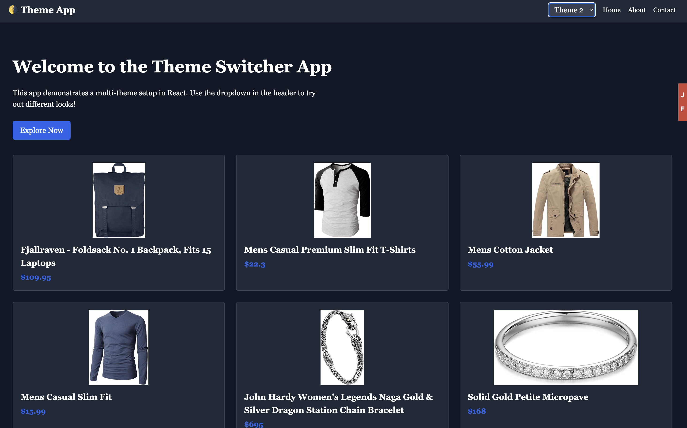
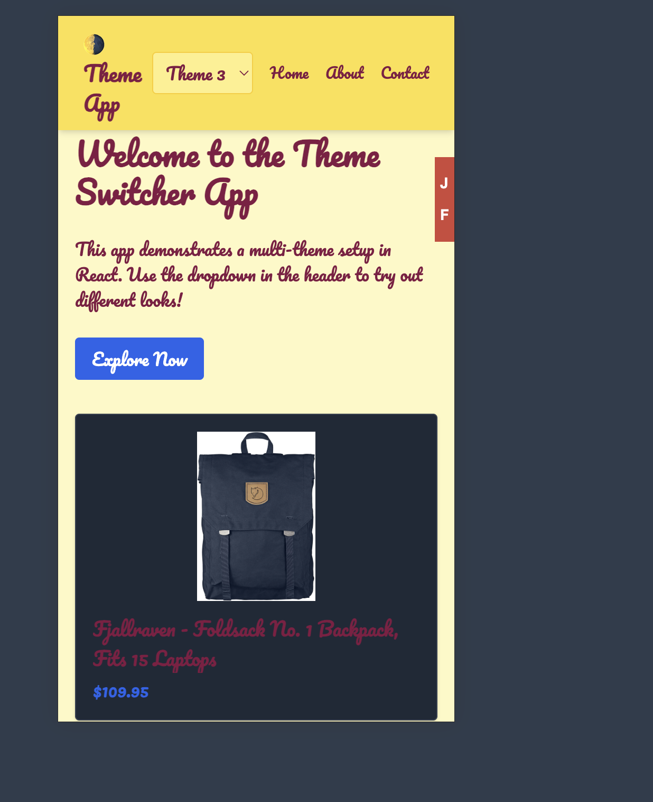

MANISH KUMAR(React Developer)


#  Multi-Theme React App

Hey there! 
This is a React app I built theme switching using **TypeScript**, **Tailwind CSS**, and the **Context API**. It also uses **React Router** for navigation and fetches products from the FakeStore API just to keep things realistic. No big UI libraries like MUI or AntD — I wanted to keep everything lightweight and custom.

---

##  Features

- Three themes to try out (Light, Dark Sidebar, and a playful one)
- Theme stays saved even after refreshing the page (Used `localStorage`)
- Simple and smooth animations when switching themes
- Fully responsive — works well on mobile and desktop
- Theme state is managed using React’s Context API
- Pages: Home, About, Contact, and a fallback 404 page
- Data fetched from https://fakestoreapi.com/products
- Built completely using **TypeScript**
- No unnecessary UI frameworks — just raw Tailwind and React

---

## 📸 What It Looks Like







---

## 🛠 Tech Stack

- React + TypeScript
- Tailwind CSS
- React Router
- Context API
- FakeStoreAPI

---

## 🚀 Getting Started

To run this on your local machine:

1. Clone the repo:

```bash
git clone https://github.com/your-username/react-theme-app.git
cd react-theme-app
```

2. Install the dependencies:

```bash
npm install
# or
npm i
```


3.Start the dev server:
```bash
npm run dev
```
